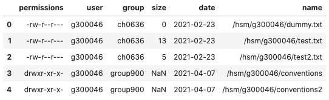

=====
pyslk
=====

.. image:: https://img.shields.io/pypi/v/pyslk.svg
        :target: https://pypi.python.org/pypi/pyslk

.. image:: https://readthedocs.org/projects/pyslk/badge/?version=latest
        :target: https://pyslk.readthedocs.io/en/latest/?version=latest
        :alt: Documentation Status

A simple python binding for the DKRZ StrongLink command line interface (slk).

* Free software: MIT license
* Documentation: https://pyslk.readthedocs.io.

Features
--------

* control slk commands from python.
* get tabulated archive information.

Examples
--------

.. code-block:: python

    slk.ls("/hsm/g300046", recursive=True, decode="pandas").head()
    

Troubleshooting
---------------

If you want to use the bindings in the jupyterhub, you might have to add the executable to the `kernel.json` file. E.g, for use the the DKRZ jupyterhub, you need to adapt it to something like

.. code-block:: python

    {
     "argv": [
         "/home/user/kernels/new-kernel/bin/python",
         "-m",
         "ipykernel_launcher",
         "-f",
         "{connection_file}"
     ],
     "display_name": "new-kernel",
     "language": "python",
     "env": {
      "PATH": "/sw/rhel6-x64/slk/slk-3.1.36/bin:/sw/rhel6-x64/openjdk-15.0.2/bin:$PATH",
      "JAVA_HOME": "/sw/rhel6-x64/openjdk-15.0.2"
            }
    }

See also the documentation on `jupyter kernels <https://jupyterhub.gitlab-pages.dkrz.de/jupyterhub-docs/kernels.html#use-your-own-kernel>`_.

Credits
-------

This package was created with Cookiecutter_ and the `audreyr/cookiecutter-pypackage`_ project template.

.. _Cookiecutter: https://github.com/audreyr/cookiecutter
.. _`audreyr/cookiecutter-pypackage`: https://github.com/audreyr/cookiecutter-pypackage
